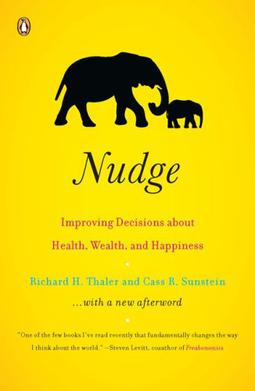

Karla Sifuentes
Lab: Introduction to Markdown
March 23, 2023

# Basic HTML ELements in Markdown

## A summary of the most recent book I read:
The most recent book I read is called *Nudge: Improving Decisions about Health, Wealth, and Happiness*, written by Richard Thaler and Cass Sunstein, professors at reknowned universities. This is the cover of the book:



```
<p><strong>A bit about the authors:</strong></p>
<p>Richard Thaler is an American economist and professor of Behavioral Science and Economics at the University of Chicago. Cass Sunstein is an expert in constitutional law and Professor of Behavioral Economics at Harvard Law School.</p>
```
 ## Here are the main arguments the authors make:


* **Choice architects**, which are poeple who frame information and design the presentation of ideas, have lots of power in the way people make decisions
* People are fallible and sometimes take mental shortcuts, or **heuristics** 
* **Libertarian Paternalism** is a choice architecture strategy that allows people to make the best decision for themselves while still allowing choice architects to manipulate the structure of choices


>If you are interested in learning more about nudges and how choice architects influence our decisions click [here](https://effectiviology.com/nudge/).